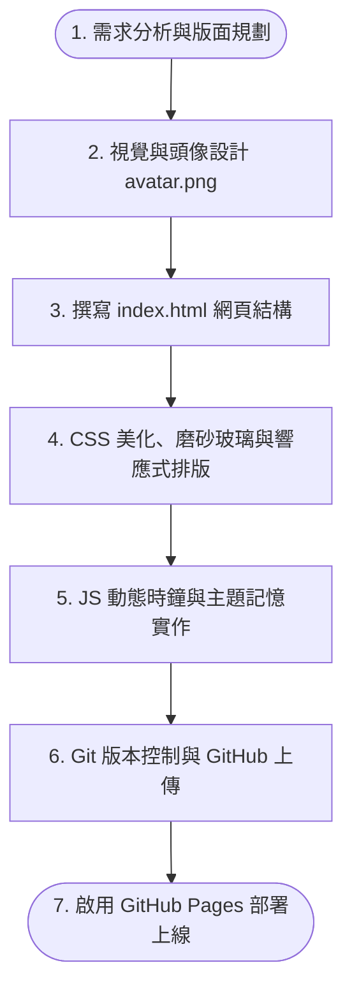

# 📋 個人網站專案開發與設計流程報告

本報告詳細記錄了 **L2-HW2 個人網站專案**從規劃、設計、前端實作至雲端部署的完整開發工作流程。本專案專為 **Ian Wang** 客製化設計，旨在建立一個兼具視覺美感與即時動態功能的創意個人履歷網站。

---

## 🔄 網頁開發核心流程圖 (Mermaid)

### 🖼️ 網頁設計與開發視覺流程圖

---

## 🛠️ 開發階段與實作說明

### 階段一：需求分析與版面規劃 (Planning)
- **核心目標**：分析作業要求，規劃個人履歷必備元素：英文名字（Ian Wang）、每秒自動更新時鐘（Current Time）、自我介紹、作品集、聯絡表單，並引入高階磨砂玻璃（Glassmorphism）與深淺主題切換的設計風格。
- **配置規劃**：採用單頁式（SPA）滾動版面，利用 CSS Grid 與 Flexbox 實現流暢的區塊過渡。

### 階段二：視覺與品牌資產生成 (Visual Assets)
- **核心目標**：建立專屬的個人視覺識別。
- **實作內容**：使用 AI 圖像生成技術，繪製出符合科技感與簡約美學的個人插畫頭像並儲存為 [avatar.png](file:///d:/AI%20class/HW2/avatar.png)，提升網站的專業度與親和力。

### 階段三：HTML 網頁結構編寫 (HTML Markup)
- **核心目標**：撰寫語意化且符合 SEO 規範的網頁骨架。
- **實作內容**：編寫 [index.html](file:///d:/AI%20class/HW2/index.html)，建立 `<header>` (導覽列)、`<main>` (英雄區、關於我、專業技能、精選作品、聯絡我) 與 `<footer>` (頁尾) 區塊，並為所有互動元件配置唯一的 `id` 以利程式碼控制。

### 階段四：CSS 美化與自適應排版 (CSS Styling & RWD)
- **核心目標**：實作磨砂玻璃視覺體系與完全響應式（RWD）介面。
- **實作內容**：編寫 [style.css](file:///d:/AI%20class/HW2/style.css)，定義兩套 CSS 變數（深色模式、淺色模式），使用 `backdrop-filter: blur()` 與半透明邊框建立玻璃拟態卡片；加入浮動背景發光裝飾與微動畫；設定 `@media` 媒體查詢以確保網頁在手機、平板與電腦皆能完美呈現。

### 階段五：JS 即時時鐘與功能邏輯 (JavaScript Logic)
- **核心目標**：完成動態時間更新與使用者偏好儲存。
- **實作內容**：編寫 [script.js](file:///d:/AI%20class/HW2/script.js)：
  1. 使用 `setInterval` 每秒自動取得並格式化系統時間（時:分:秒）與日期。
  2. 透過 `Intl.DateTimeFormat` 自動偵測本地時區並顯示（如台北時間 GMT+8）。
  3. 控制深淺色主題切換，並以 `localStorage` 將使用者的主題偏好儲存在瀏覽器中。
  4. 實作導覽列滾動縮減效果，以及滑鼠移動時背景光暈微幅偏移的視差動態特效。

### 階段六：Git 儲存庫版本控制與部署 (Git & Deployment)
- **核心目標**：程式碼託管與靜態網站發布。
- **實作內容**：
  1. 在本地專案資料夾進行 Git 初始化 (`git init`)、提交程式碼。
  2. 將專案關聯至 GitHub 遠端儲存庫並推送至 `main` 分支。
  3. 前往 GitHub Repository 後台的 Settings 啟用 **GitHub Pages** 服務，將網站成功託管上線至網際網路。
