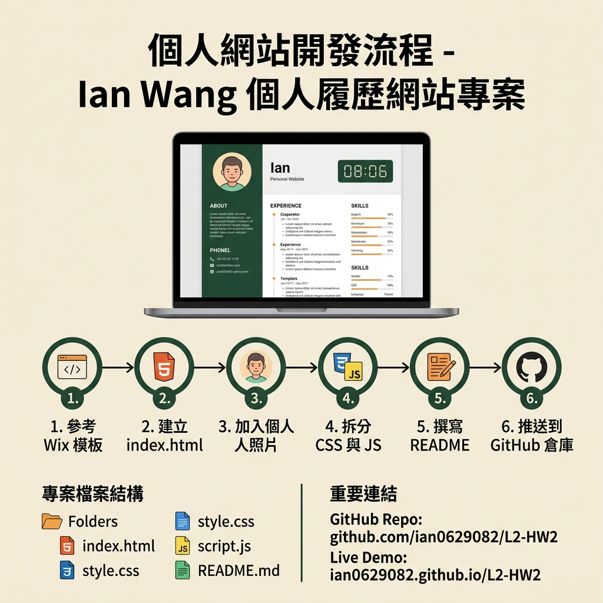

# 📋 個人網站開發流程報告

**專案紀錄日期**：2026-06-05  
**專案名稱**：Ian Wang 個人履歷網站專案  
**專案概述**：以 Wix 履歷模板為參考，打造簡潔、專業的個人網站，並具備即時時間顯示與響應式設計。

---

## 🖼️ 專案開發流程視覺圖

---

## 🎯 網站特色 (Key Features)
- **簡潔履歷風格**：以 Wix 簡約履歷設計為參考，呈現大氣且現代感十足的介面。
- **個人照片展示**：加入自訂個人頭像插畫（`avatar.png`），取代預設的空白圖像。
- **即時時間顯示**：實作每秒自動更新的動態時鐘與本地時區自動偵測。
- **響應式設計**：支援 RWD 響應式佈局，完美相容於手機、平板與桌上型電腦。

## 💻 技術使用 (Tech Stack)
- **HTML5**：建構語意化網頁骨架。
- **CSS3**：實現磨砂玻璃擬態 (Glassmorphism)、發光漸層背景與自適應排版。
- **JavaScript (ES6+)**：控制即時時鐘每秒更新、深淺主題切換及 `localStorage` 使用者偏好存取。

---

## 🔄 開發流程六大步驟

### 1️⃣ 參考 Wix 履歷模板
- **說明**：以 Wix "Resume (Simple)" 簡約履歷模板為設計參考，確定整體的版面配置、配色體系與視覺風格方向。

### 2️⃣ 建立 index.html
- **說明**：建立網站核心結構與內容。包含首頁 (Hero)、關於我 (About)、專業技能 (Skills)、精選作品 (Portfolio) 以及聯絡表單 (Contact) 等語意化區塊。

### 3️⃣ 加入個人照片
- **說明**：將生成的個人頭像插畫檔案（`avatar.png`）加入網站，取代原始碼中的預設頭像，使個人履歷更具個人特色與品牌識別。

### 4️⃣ 拆分 CSS 與 JS
- **說明**：將網頁樣式與行為邏輯獨立分離。建立 `style.css` 負責視覺呈現與 RWD 控制；建立 `script.js` 負責動態邏輯，提升程式碼的模組化與可維護性。

### 5️⃣ 撰寫 README 加入資訊
- **說明**：編寫專案說明文件 `README.md`。詳細載入 GitHub 儲存庫連結、Live Demo 網址、本機啟動步驟及專案說明。

### 6️⃣ 推送到程式碼倉庫
- **說明**：將所有開發檔案提交並上傳至 GitHub 遠端儲存庫，並設定啟用 GitHub Pages 託管服務，提供無縫的線上 Demo 網址。

---

## 📂 專案檔案結構
- 🌐 **[index.html](file:///d:/AI%20class/HW2/index.html)**：網站主要結構與骨架
- 🎨 **[style.css](file:///d:/AI%20class/HW2/style.css)**：網站美學與自適應樣式表
- ⚡ **[script.js](file:///d:/AI%20class/HW2/script.js)**：即時時鐘更新與主題切換邏輯
- 🖼️ **[avatar.png](file:///d:/AI%20class/HW2/avatar.png)**：個人頭像插畫圖片
- 📊 **[work_log_process.md](file:///d:/AI%20class/HW2/work_log_process.md)**：開發流程報告檔案（本文件）
- 📝 **[daily_log.md](file:///d:/AI%20class/HW2/daily_log.md)**：每日開發工作日誌
- 📖 **[README.md](file:///d:/AI%20class/HW2/README.md)**：專案操作與說明檔案

---

## 🔗 重要連結
- **GitHub 儲存庫**：[https://github.com/ian0629082/L2-HW2](https://github.com/ian0629082/L2-HW2)
- **Live Demo 網頁**：[https://ian0629082.github.io/L2-HW2/](https://ian0629082.github.io/L2-HW2/)

---

## 🏆 完成成果
一個簡潔、專業、具備即時時間顯示的個人履歷網站，成功上線並可透過 Live Demo 線上瀏覽！

> 💡 **持續學習，持續創作，讓想法落地成真。**
