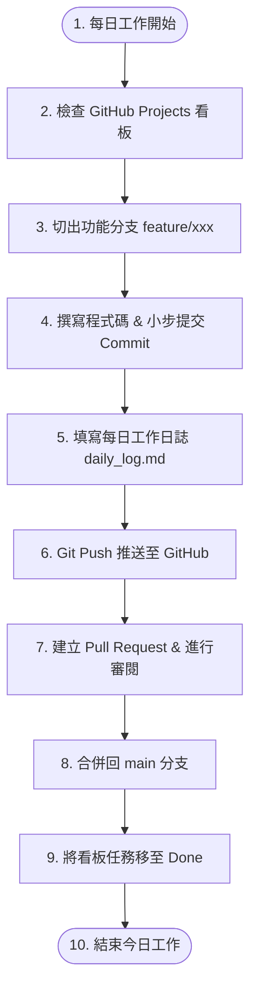

# 📋 GitHub 專案開發工作日誌流程指南

本指南旨在為您建立一套結合 **Git 版本控制** 與 **GitHub 專案管理** 的專業開發工作日誌流程（適用於個人專案及團隊協作）。

這套流程能確保您的開發進度「有跡可循」、Commit 歷史「清晰易讀」，且能自動產出完整的工作紀錄。

---

## 🔄 工作日誌核心流程圖 (Mermaid)



---

## 🛠️ 流程步驟詳細說明

### 步驟一：工作開始與任務確認
1. **開啟看板**：每天早上，進入 GitHub 儲存庫的 **Projects** 看板。
2. **認領任務**：將預計今日完成的任務卡片從 `To Do` 拖曳到 `In Progress`（進行中）。
3. **開立分支**：在本地端 Git 環境，確保拉取最新 main 程式碼，並切出功能分支：
   ```bash
   git checkout main
   git pull origin main
   git checkout -b feature/today-task
   ```

### 步驟二：程式開發與規範提交 (Commit)
在開發過程中，秉持「**小步提交**」原則，完成一個小功能就提交一次。Commit Message 建議遵循 **Conventional Commits** 規範：
- 格式：`縮寫(範疇): 描述文字`
- 常用縮寫：
  - `feat`: 新增功能 (Feature)
  - `fix`: 修復錯誤 (Bug Fix)
  - `docs`: 修改文件或日誌 (Documentation)
  - `style`: 程式碼格式調整（不影響邏輯）
  - `refactor`: 重構程式碼（非增功能或修 Bug）

*範例：*
```bash
git commit -m "feat(clock): 實作每秒自動更新的即時時鐘"
git commit -m "style(css): 優化磨砂玻璃卡片在手機版上的邊距"
```

### 步驟三：填寫工作日誌 (`daily_log.md`)
在今日開發工作告一段落時，打開專案中的 [daily_log.md](file:///d:/AI%20class/HW2/daily_log.md)，記錄今天的產出與心得。
工作日誌卡片模板：
```markdown
### 📅 2026-06-05 (五)
- **今日目標**：完成個人網站核心功能與即時時鐘
- **完成事項**：
  - [x] 設計磨砂玻璃 UI 樣式
  - [x] 實作每秒自動更新的時鐘與本地時區偵測
- **遇到的困難與解決方案**：
  - *問題*：切換淺色主題時導覽列文字對比度不足。
  - *解決方案*：調整 CSS 變數 `--text-secondary` 在亮色主題下的 HSL 數值。
- **明日規劃**：部屬至 GitHub Pages 並進行跨瀏覽器相容性測試。
```

### 步驟四：推送並發起 PR 合併
1. **推送分支**：將開發完的分支與更新後的日誌推送到 GitHub：
   ```bash
   git add .
   git commit -m "docs(log): 更新 2026-06-05 工作日誌"
   git push origin feature/today-task
   ```
2. **建立 PR**：在 GitHub 網頁端發起 Pull Request (PR)。在 PR 中描述今天完成的事項，並請求審閱。
3. **合併 (Merge)**：確認無誤後，合併 PR 回 `main` 主分支，並刪除開發分支。
4. **結案**：回到 GitHub Projects 看板，將今日任務拖曳至 `Done`（已完成）。

---

## 📈 流程的好處
1. **可讀性極高**：任何人點進您的 GitHub Commits 或 PR 紀錄，就能知道您每一天在做什麼。
2. **自動化紀錄**：GitHub 的 Commit 紀錄本身就是一份精準的「技術日誌」。
3. **專案進度透明**：搭配 Kanban 專案管理看板，能有效控管時間避免工作延宕。
